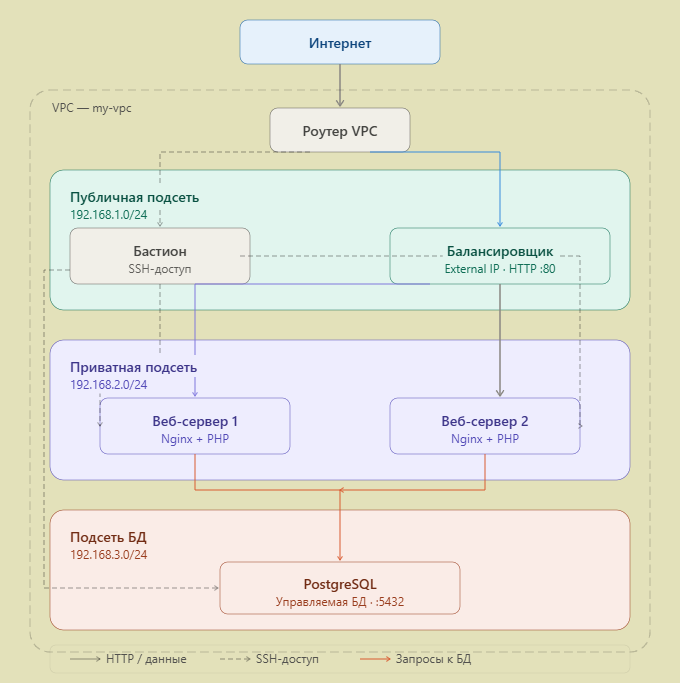

# Инфраструктура VK Cloud

Проект для автоматического развертывания инфраструктуры веб-серверов в VK Cloud.
Поддерживает запуск как локально через bash-скрипты, так и через GitHub Actions pipeline.

## Архитектура



## Технологии

- **Terraform** — развертывание инфраструктуры
- **Packer** — сборка образов виртуальных машин
- **VK Cloud** — облачная платформа
- **GitHub Actions** — CI/CD pipeline
- **Nginx + PHP** — веб-сервер
- **PostgreSQL** — база данных

## Быстрый старт

### Требования

- Аккаунт VK Cloud
- Terraform >= 1.9.0
- Packer >= 1.9.0
- AWS CLI >= 2.0.0
- OpenStack CLI
- Unix OS/WSL 

### Локальный запуск

**1. Установите инструменты**

```bash
# Terraform
wget https://releases.hashicorp.com/terraform/1.9.0/terraform_1.9.0_linux_amd64.zip
unzip terraform_1.9.0_linux_amd64.zip
sudo mv terraform /usr/local/bin/

# Packer
wget https://releases.hashicorp.com/packer/1.9.0/packer_1.9.0_linux_amd64.zip
unzip packer_1.9.0_linux_amd64.zip
sudo mv packer /usr/local/bin/

# AWS CLI и OpenStack CLI
pip install awscli python-openstackclient
```

**2. Создайте SSH ключ**

```bash
ssh-keygen -t ed25519 -f ~/.ssh/vk-cloud-key
```

**3. Настройте переменные окружения**

```bash
cp .env.example .env
nano .env  # заполните своими значениями
```

**4. Запустите развертывание**

```bash
chmod +x deploy.sh
./scripts/deploy.sh
```

**5. Удаление инфраструктуры**

```bash
chmod +x destroy.sh
./scripts/destroy.sh
```

### Запуск через GitHub Actions

**1. Добавьте секреты в GitHub**

Перейдите в `Settings → Secrets and variables → Actions` и добавьте:

| Секрет | Описание |
|--------|----------|
| `PROJECT_NAME` | Имя проекта |
| `IMAGE_NAME` | Имя образа Packer |
| `MY_IP` | Ваш IP адрес (`x.x.x.x/32`) |
| `BUCKET_NAME` | Имя S3 бакета для state |
| `S3_ACCESS_KEY` | Access key для S3 |
| `S3_SECRET_KEY` | Secret key для S3 |
| `OS_USERNAME` | Логин VK Cloud |
| `OS_PASSWORD` | Пароль VK Cloud |
| `OS_PROJECT_ID` | Project ID VK Cloud |
| `DB_PASSWORD` | Пароль базы данных |
| `SSH_PUBLIC_KEY` | Публичный SSH ключ |

**2. Настройте environments**

Перейдите в `Settings → Environments` и создайте:
- `production` — для развертывания (с подтверждением)
- `iac-destroy` — для удаления (с подтверждением)

**3. Запустите pipeline**

- **Развертывание**: `Actions → Deploy Infrastructure → Run workflow`
- **Удаление**: `Actions → Destroy Infrastructure → Run workflow`

## Переменные окружения

Скопируйте `.env.example` в `.env` и заполните значениями:

```bash
# Общие настройки
export PROJECT_NAME="my-project"
export IMAGE_NAME="web-server-base"
export MY_IP="x.x.x.x/32"

# S3 бакет для Terraform state
export BUCKET_NAME="my-project-terraform-state"

# Учётные данные VK Cloud (S3)
export S3_ACCESS_KEY="ваш_access_ключ"
export S3_SECRET_KEY="ваш_secret_ключ"

# Учётные данные VK Cloud (провайдер)
export OS_USERNAME="ваш_логин"
export OS_PASSWORD="ваш_пароль"
export OS_PROJECT_ID="ваш_project_id"
export OS_USER_DOMAIN_NAME="users"
export OS_REGION_NAME="RegionOne"
export OS_AUTH_URL="https://msk.cloud.vk.com/infra/identity/v3/"
```

## Что создаёт проект

| Ресурс | Описание |
|--------|----------|
| VPC + 3 подсети | Публичная, приватная, БД |
| Роутер | С подключением к интернету |
| Bastion ВМ | Для безопасного SSH доступа |
| 2 веб-сервера | Nginx + PHP в приватной подсети |
| Балансировщик | Распределяет трафик между веб-серверами |
| PostgreSQL | Управляемая БД в отдельной подсети |
| S3 бакет | Хранение Terraform state с версионированием |
| Security Groups | Для каждого типа ресурсов |
| Packer образ | Ubuntu с предустановленным Nginx и PHP |

## Подключение к ВМ

```bash
# Подключение к Bastion
ssh -i ~/.ssh/vk-cloud-key ubuntu@<BASTION_IP>

# Подключение к веб-серверу через Bastion
ssh -i ~/.ssh/vk-cloud-key \
    -o "ProxyCommand ssh -i ~/.ssh/vk-cloud-key -W %h:%p ubuntu@<BASTION_IP>" \
    ubuntu@<WEB_IP>
```

## Автор

[(https://github.com/Tthamon/)]

````